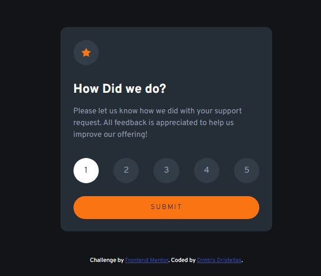

# Frontend Mentor - Interactive rating component solution

This is a solution to the [Interactive rating component challenge on Frontend Mentor](https://www.frontendmentor.io/challenges/interactive-rating-component-koxpeBUmI). Frontend Mentor challenges help you improve your coding skills by building realistic projects. 

## Table of contents

- [Overview](#overview)
  - [The challenge](#the-challenge)
  - [Screenshot](#screenshot)
  - [Links](#links)
- [My process](#my-process)
  - [Built with](#built-with)
  - [What I learned](#what-i-learned)
- [Author](#author)


## Overview

### The challenge

Users should be able to:

- View the optimal layout for the app depending on their device's screen size
- See hover states for all interactive elements on the page
- Select and submit a number rating
- See the "Thank you" card state after submitting a rating

### Screenshot




### Links

- Solution URL: [Add solution URL here](https://github.com/dimitrisdr/interactive-rating-component.git)
- Live Site URL: [Add live site URL here](https://dimitrisdr.github.io/interactive-rating-component/)

## My process

### Built with

- Semantic HTML5 markup
- CSS custom properties
- Flexbox
- CSS Grid
- Mobile-first workflow

### What I learned


```html
  <div class="form-control">
    <input value="1" name="rating" type="radio" id="one">
    <label  for="one" class="rate-label">1</label>
  </div>
```

```css
.rate-label {
    width: 3rem;
    height: 3rem;
    border-radius: 50%;
    background-color: var(--Dark-Blue-light);
    display: grid;
    place-content: center;
    cursor: pointer;
    transition: 0.2s ease-in;
    color: var(--Light-Grey);
}

.rate-label:hover {
    background-color: var(--Orange);
    color: var(--Dark-Blue);
}

input[name="rating"] {
    display: none;
    appearance: none;
}

input[name="rating"]:checked ~.rate-label {
    background-color: white;
    color: var(--Dark-Blue);
} 

```
```js
function handleSubmit(e) {
    e.preventDefault()
    const formData = Object.fromEntries(new FormData(e.target));   
    result.innerText = formData.rating
    sections.forEach(sec => sec.classList.toggle('hidden'))
    // switching back for testing
    setTimeout(()=>{
        sections.forEach(sec => sec.classList.toggle('hidden'))
    }, 1000)
}
```
## Author

- Frontend Mentor - [@dimitrisdr](https://www.frontendmentor.io/profile/dimitrisdr)
